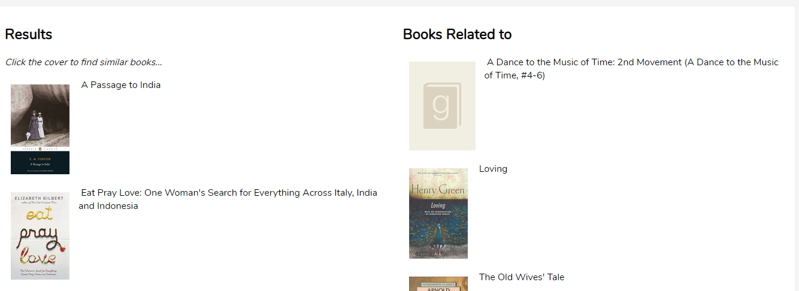

# vuex-state-app

This is a sample app based on learning from various sources on Vue + VueX + REST APIs.
There are two demos available

- Simple Crud - Basic CRUD operation using VueX 3) Books and Recommendations
- Modified version of the post by [Raymond Camden](https://www.raymondcamden.com/2018/01/05/another-example-of-vuejs-and-vuex-an-api-wrapper)
  - Upgraded to use the newer techniques of using Vuex 3
  - Error handling
  - Usage of unfetch
  - Add skeleton ui to improve user perceived performance

## Project setup

```
npm install
```

### Compiles and hot-reloads for development

```
npm run serve
```

### Compiles and minifies for production

```
npm run build
```

### Lints and fixes files

```
npm run lint
```

### SVG Loading Cards (user perceived performance)

- Vue skeleton loading based on `vue-content-loading`.



