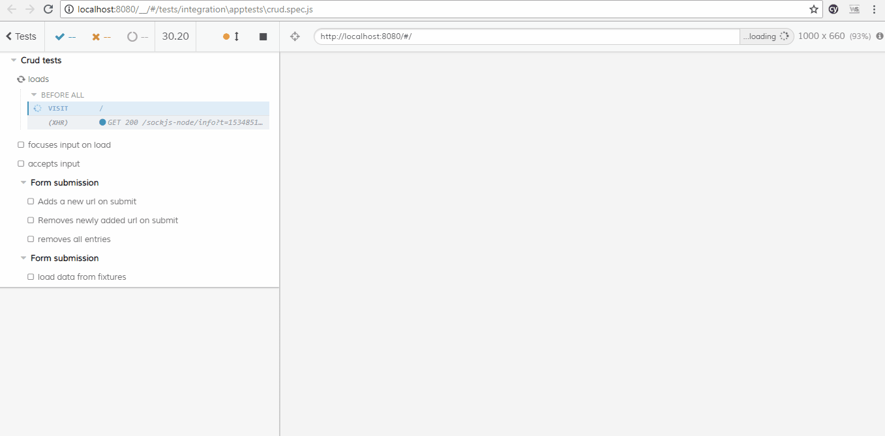

# vuex-state-app

This is a sample app based on learning from various sources on Vue + VueX + REST APIs.
There are two demos available

- Simple Crud - Basic CRUD operation using VueX 3) Books and Recommendations
- Modified version of the post by [Raymond Camden](https://www.raymondcamden.com/2018/01/05/another-example-of-vuejs-and-vuex-an-api-wrapper)
  - Upgraded to use the newer techniques of using Vuex 3
  - Error handling
  - Usage of unfetch
  - Add skeleton ui to improve user perceived performance
  - Cypress.io Integration and IDE configuration for intellisense

## Project setup

```
npm install
```

### Compiles and hot-reloads for development

```
npm run serve
```

### Compiles and minifies for production

```
npm run build
```

### Lints and fixes files

```
npm run lint
```

### SVG Loading Cards (user perceived performance)

- Vue skeleton loading based on `vue-content-loading`.


### Cypress Windows installation

- Currently windows 64x is not supported so we need to use a workaround to use the win32 binaries of cypress

- Manually download the Cypress binary for win32 https://download.cypress.io/desktop/3.1.0?platform=win32

- Set cypress install binary path so that the cypress install skips it

```
set CYPRESS_INSTALL_BINARY=[Full Path of the downloaded cypress.zip]
```

```
e.g. set CYPRESS_INSTALL_BINARY=e:\cypress.zip
```

- Install cypress (Skip the above step for non windows machines)

```
npm i -D cypress
```

- Set HTTP_PROXY,HTTPS_PROXY if behind the corporate firewall

```
set HTTP_PROXY=[proxy url]
```

### Launch Cypress console

```
npm run test:integration
```

#### Sample cypress test execution


